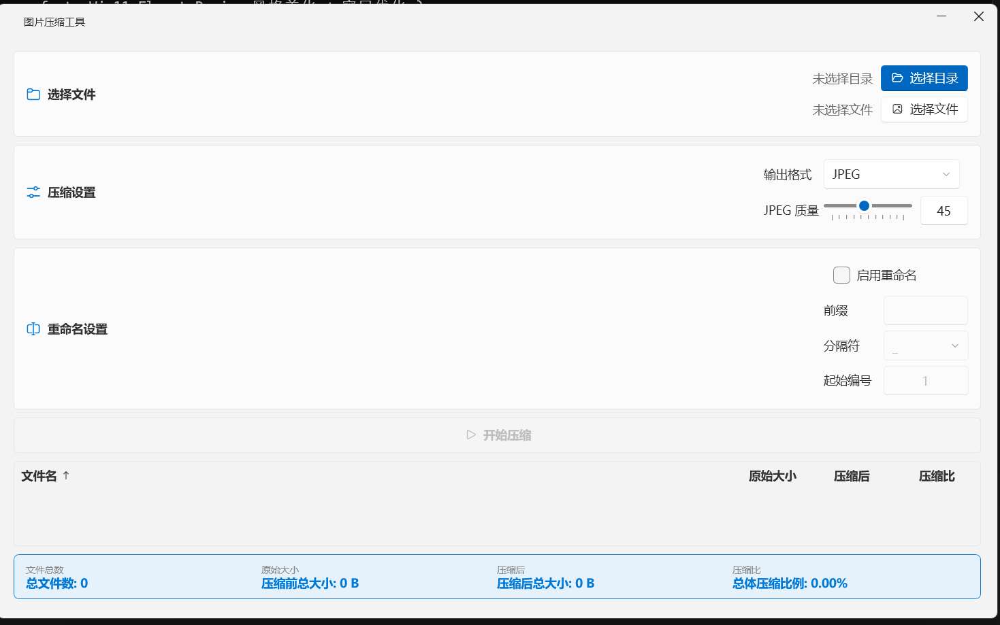

# 图片压缩工具 (ImageMinify)


[English](README_EN.md) | 中文

一个简单高效的图片压缩工具，基于 C# WPF 开发，支持多种格式，提供高质量 PNG/JPEG/WebP 压缩，并具有批量处理和文件重命名功能。

## 相关项目

本项目有两个版本，满足不同使用场景：

| 版本 | 描述 | 开源地址 |
|------|------|----------|
| **桌面版** | 当前项目，基于 C# WPF + WPF-UI 的桌面应用 | [ImageMinify](https://github.com/Moresl/ImageMinify) |
| **网页版** | 基于 React + FastAPI 的在线图片压缩工具 | [snapimg](https://github.com/Moresl/snapimg) |

## 功能特点

- **多格式支持**：支持 JPEG、PNG、WebP 等常见图片格式
- **批量处理**：可选择整个目录或特定图片文件进行压缩
- **格式转换**：可将图片转换为 JPEG、PNG 或 WebP 格式
- **PNG 量化压缩**：支持 imagequant 算法 + Floyd-Steinberg 抖动
- **JPEG 优化**：支持 MozJPEG 无损优化（环境可用时）
- **EXIF 信息**：支持读取和保留图片 EXIF 元数据
- **Fluent 设计**：采用 [WPF-UI](https://github.com/lepoco/wpfui) 实现现代 Fluent Design 风格
- **文件重命名**：支持自定义前缀、分隔符和序号
- **详细统计**：显示压缩前后的文件大小和压缩比例
- **设置持久化**：自动保存用户偏好设置

## 技术栈

- **框架**：.NET 10 + WPF
- **UI 库**：[WPF-UI](https://github.com/lepoco/wpfui)（Fluent Design）
- **图像处理**：[SixLabors.ImageSharp](https://github.com/SixLabors/ImageSharp)
- **EXIF 读取**：[MetadataExtractor](https://github.com/drewnoakes/metadata-extractor-dotnet)
- **MVVM**：[CommunityToolkit.Mvvm](https://github.com/CommunityToolkit/dotnet)
- **原生压缩**：imagequant（可选）、MozJPEG（可选）

## 截图



## 最新版本

**v2.1.0** - UI 优化与图标更新

从 [Releases](https://github.com/Moresl/ImageMinify/releases/tag/v2.1.0) 下载最新版本。

## 安装方法

### 方法 1：下载可执行文件

1. 从 [Releases](https://github.com/Moresl/ImageMinify/releases) 页面下载最新版本
2. 解压缩下载的文件
3. 双击 `ImageMinify.exe` 运行程序

### 方法 2：从源代码构建

**前置要求**：
- [.NET 10 SDK](https://dotnet.microsoft.com/download/dotnet/10.0)

```bash
# 克隆仓库
git clone https://github.com/Moresl/ImageMinify
cd ImageMinify

# 构建项目
dotnet build -c Release

# 运行程序
dotnet run -c Release
```

## 使用方法

1. **选择文件或目录**：
   - 点击"选择目录"按钮选择包含图片的文件夹
   - 或点击"选择文件"按钮选择一个或多个图片文件

2. **选择输出格式**：
   - 保持原格式：保持原始格式但进行优化
   - JPEG：转换为 JPEG 格式（可调整质量）
   - PNG：转换为优化的 PNG 格式
   - WebP：转换为 WebP 格式

3. **调整设置**：
   - 调整压缩质量滑块
   - 如需重命名文件，勾选"启用重命名"并设置相关选项

4. **开始压缩**：
   - 点击"开始压缩"按钮开始处理
   - 处理完成后，可在表格中查看每个文件的压缩结果

## 发布构建

```bash
# 发布为独立可执行文件
dotnet publish -c Release -r win-x64 --self-contained true
```

生成的文件位于 `bin/Release/net10.0-windows/win-x64/publish/` 目录。

## 项目结构

```
ImageMinify/
├── App.xaml(.cs)              # 应用入口
├── GlobalUsings.cs            # 全局 using 声明
├── ImageMinify.csproj         # 项目文件
├── Models/                    # 数据模型
│   ├── CompressionResult.cs   # 压缩结果
│   ├── CompressionSummary.cs  # 压缩统计
│   ├── EngineCapabilities.cs  # 引擎能力
│   └── RenameSettings.cs      # 重命名设置
├── Services/                  # 业务服务
│   ├── ImageCompressor.cs     # 图像压缩（主服务）
│   ├── PngCompressor.cs       # PNG 压缩
│   ├── JpegCompressor.cs      # JPEG 压缩
│   ├── WebpCompressor.cs      # WebP 压缩
│   ├── ExifService.cs         # EXIF 元数据
│   ├── FileRenameService.cs   # 文件重命名
│   └── SettingsService.cs     # 设置持久化
├── ViewModels/                # 视图模型 (MVVM)
│   └── MainViewModel.cs       # 主视图模型
├── Views/                     # 视图
│   └── MainWindow.xaml(.cs)   # 主窗口
├── Helpers/                   # 工具类
└── tests/                     # 单元测试
```

## 贡献

欢迎贡献！请查看 [贡献指南](CONTRIBUTING.md) 了解详情。

## 许可证

本项目采用 MIT 许可证 - 详见 [LICENSE](LICENSE) 文件。

## 致谢

- [SixLabors.ImageSharp](https://github.com/SixLabors/ImageSharp) - 跨平台图像处理
- [WPF-UI](https://github.com/lepoco/wpfui) - Fluent Design WPF 控件库
- [CommunityToolkit.Mvvm](https://github.com/CommunityToolkit/dotnet) - MVVM 工具包
- [MetadataExtractor](https://github.com/drewnoakes/metadata-extractor-dotnet) - 图片元数据读取
